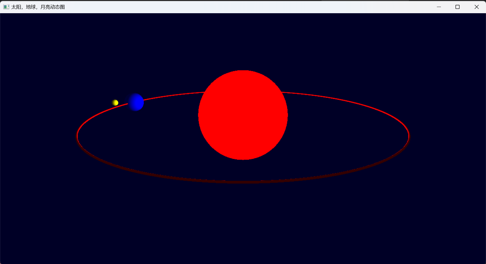
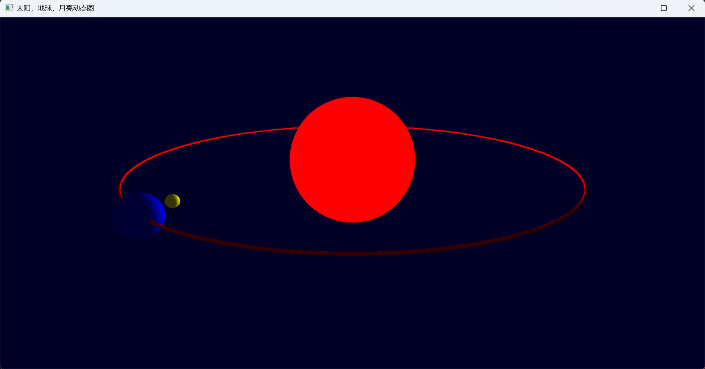
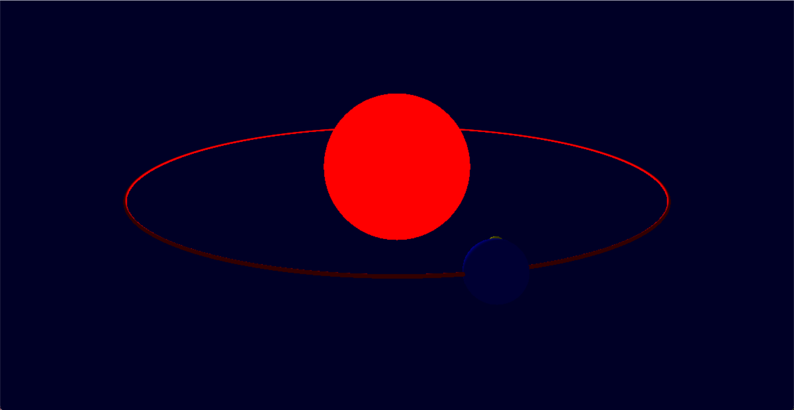

# solar-system-dynamic-map

✨**基于 C++(MSVC) 和 OpenGL 的太阳系（太阳，地球，月球）系统动态图绘制**✨ 3维视角，坐标变换，旋转，动态刷新，光照，透视，投影。📌包含可执行文件，环境配置指南。

## 页面展示




## 运行环境

运行环境
- `windows 11`
- `Visual Studio 2022`
- `OpenGL`
    * `glfw-3.3.8.bin.WIN64`
    * `glutdlls37beta`

配置方法参考这篇我转载的知乎文章 [VS2022的openGL环境搭建（完整篇）](https://zhuanlan.zhihu.com/p/486459964)

`Visual Studio 2022` 配置 `OpenGL` 所需相关资源在 `conf` 文件夹内。

## 项目结构

```txt
│  glad.c
│  LICENSE
│  packages.config
│  README.md
│  solar.cpp  # 源代码
│  solar.sln  # vs项目入口
│  solar.vcxproj
│  solar.vcxproj.filters
│  solar.vcxproj.user
│
├─conf
├─packages
├─readme_img
└─x64
    └─Debug
        │  freeglut.dll
        │  glad.obj
        │  glew32.dll
        │  glewinfo.exe
        │  glewinfo.txt
        │  glfw3.dll
        │  solar.exe   # 可执行文件
        │  solar.exe.recipe
        │  solar.ilk
        │  solar.log
        │  solar.obj
        │  solar.pdb
        │  solar.vcxproj.FileListAbsolute.txt
        │  vc143.idb
        │  vc143.pdb
        │  visualinfo.exe
```

## 运行方法

### 运行
鼠标双击打开 `x64/ebug/solar.exe`

### 调试
用 `Visual Studio 2022` 打开 `solar.sln`，源码文件为 `solar.cpp`


# 开源许可证

此翻译版本仅供参考，以 LICENSE 文件中的英文版本为准

MIT 开源许可证：

版权所有 (c) 2023 bytesc

特此授权，免费向任何获得本软件及相关文档文件（以下简称“软件”）副本的人提供使用、复制、修改、合并、出版、发行、再许可和/或销售软件的权利，但须遵守以下条件：

上述版权声明和本许可声明应包含在所有副本或实质性部分中。

本软件按“原样”提供，不作任何明示或暗示的保证，包括但不限于适销性、特定用途适用性和非侵权性。在任何情况下，作者或版权持有人均不对因使用本软件而产生的任何索赔、损害或其他责任负责，无论是在合同、侵权或其他方面。